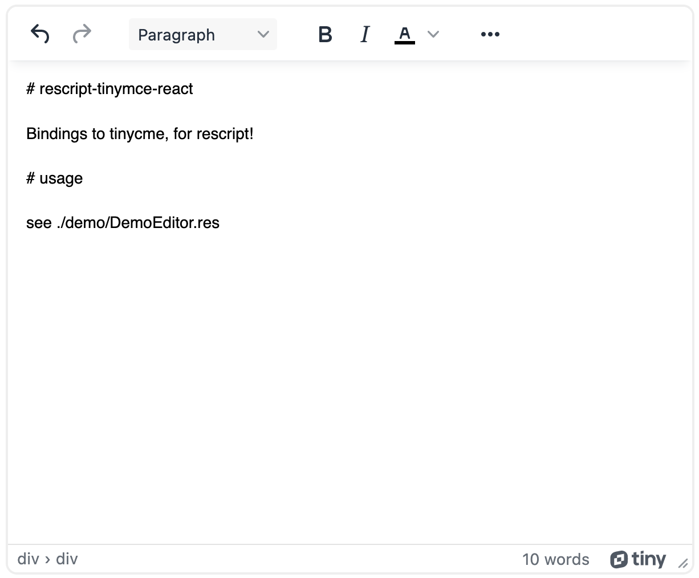

# rescript-tinymce-react

[](https://github.com/cdaringe/rescript-tinymce-react/actions/workflows/main.yml)

rescript lang react bindings to [tinymce](https://www.npmjs.com/package/tinymce).



## usage

```res
<TinyMce.Editor />
```

See `src/TinyMCEReact.rs`

## installation

`npm install --save rescript-tinymce-react`
